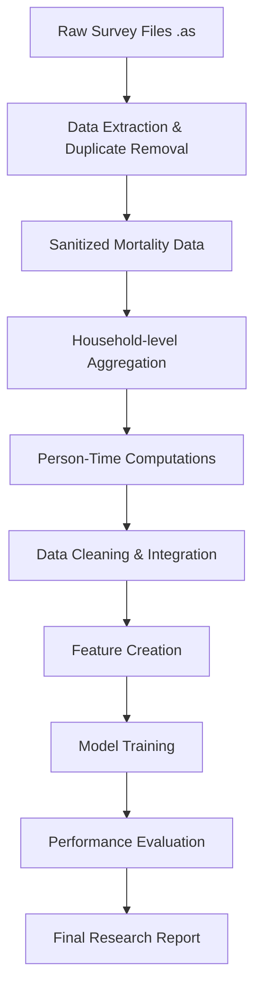

# Machine Learning Pipeline for SMART Survey Mortality Forecasting

This project implements a complete data processing and machine learning workflow designed to parse ENA for SMART survey files, compile population statistics, and forecast mortality at the household level.

---

## 1. Introduction and Objectives

Our goal is to construct a robust data pipeline capable of handling raw ENA (Emergency Nutrition Assessment) SMART survey files (`.as` format) originating from Somalia. The system is responsible for extracting mortality data, transforming individual-level records into household-level aggregates, calculating person-time indicators, standardizing location and date variables, and deploying machine learning algorithms to estimate the probability of household mortality.

---

## 2. Pipeline Workflow



---

## 3. Data Description

The data comprises anthropometric and mortality assessments carried out in Somalia, covering diverse administrative regions and livelihood zones.

| Variable | Description |
| :--- | :--- |
| **Total Files** | 100 |
| **Duplicates** | 20 (identical files ignored during processing) |
| **Unique Files** | 80 |
| **Individual Level Surveys** | 65 (Admin2: 53, LHZ: 12 — includes rosters for individuals P1-P20) |
| **Aggregate Level Surveys** | 14 (all Admin2 — basic household summary data) |
| **Problematic Surveys** | 1 (`dhuusamarreeb_idp` contains headers but lacks data rows) |
| **Timeframe** | 2013 - 2023 |
| **Format** | Plain text (ASCII) with tab-separated sections |

---

## 4. Addressed Data Issues

| Issue | Consequence | Resolution |
| :--- | :--- | :--- |
| **Header Row Bug in Aggregates** | The initial data row in aggregate surveys was incorrectly parsed as a header. This caused the first household's data to be lost and resulted in numeric column names. | Catch aggregate data blocks and insert proper column names before saving as CSV. |
| **Messy CSV Output** | Generated CSVs included irrelevant sections (like Planning or Training), preventing simple import using `pandas.read_csv()`. | Extract exclusively the mortality-related blocks and save only the structured data rows. |
| **Inconsistent Recall Periods** | The recall period fluctuates (e.g., 90, 93, 102, 125 days). Hardcoding a 90-day window skews the person-time calculations. | Read the recall period directly from each `.as` file (found 10 lines below `?Planning:`). |
| **Static File Paths** | The script relied on local, absolute directory paths, making it hard to run on different machines. | ✅ **Resolved** — Paths are now dynamic, utilizing `Path(__file__).parent` to locate files relative to the script. |

---

## 5. Core Modules

### `organize_surveys.py`
*   **Role**: Manages the first pass of survey processing. It reads `.as` files, filters out duplicates, categorizes the survey type, and pulls the raw mortality data.
*   **Updates**: Corrects the aggregate header issue and guarantees that the resulting CSVs only hold formatted mortality tables.

### `process_households.py`
*   **Role**: Consolidates individual member records into household totals (tallying members, births, deaths, arrivals, departures, and under-5 stats) and joins them with aggregate surveys.
*   **Logic**: Computes the person-time denominators for the entire household and under-5s, leveraging the extracted dynamic recall period.

### `clean_and_merge.py`
*   **Role**: Standardizes geographical names, formats dates, and combines all 80 cleaned surveys into one comprehensive dataset for modeling.

### `train_ml.py`
*   **Role**: Executes feature engineering and trains several classifiers (Logistic Regression, Decision Tree, Random Forest, SVM, Naive Bayes, KNN, XGBoost) to forecast household mortality.

---

## 6. Machine Learning Strategy

### Target Variable
*   `death_occurred` (`1` if the household experienced > 0 deaths in the recall window, `0` otherwise).

### Input Features
*   **Demographic Data**: Total household members, fraction of children under 5.
*   **Mobility**: In-migration (joined), out-migration (left).
*   **Spatiotemporal Data**: Location (District), date of survey, and month (seasonality).

### Performance Metrics
*   Accuracy
*   Precision
*   Recall (crucial for detecting mortality hotspots)
*   F1-Score
*   AUC-ROC
*   Confusion Matrix

---

## 7. Project Roadmap

| Phase | Description | State |
| :---: | :--- | :---: |
| **1** | Resolve extraction bugs & isolate CSVs | Complete |
| **2** | Execute household aggregation & time metrics | Complete |
| **3** | Standardize locations/dates & combine data | Complete |
| **4** | Construct the ML pipeline | Complete |
| **5** | Produce evaluation metrics & charts | Complete |
| **6** | Draft the final academic paper | To Do |

---

## 8. Directory Layout

```text
SMART-Mortality-Prediction/
│
├── README.md
├── docs/
│   └── implementation_plan.md
│
├── src/
│   ├── organize_surveys.py
│   ├── process_households.py
│   ├── clean_and_merge.py
│   └── train_ml.py
│
├── data/
│   ├── raw/
│   ├── intermediate/
│   └── final_mortality_analysis.csv
│
└── reports/
    ├── figures/
    └── Final_Project_Report.pdf
```

---

## 9. Quality Assurance Plan

*   **Extraction Checks**: Confirm that the number of rows in the output CSVs matches the original `.as` files perfectly, ensuring the header fix didn't drop data.
*   **Load Testing**: Verify the final dataset can be imported via `pandas.read_csv()` without any errors.
*   **Manual Verification**: Randomly select a mix of 6 surveys and manually compute the person-days to cross-check against the script's output.
